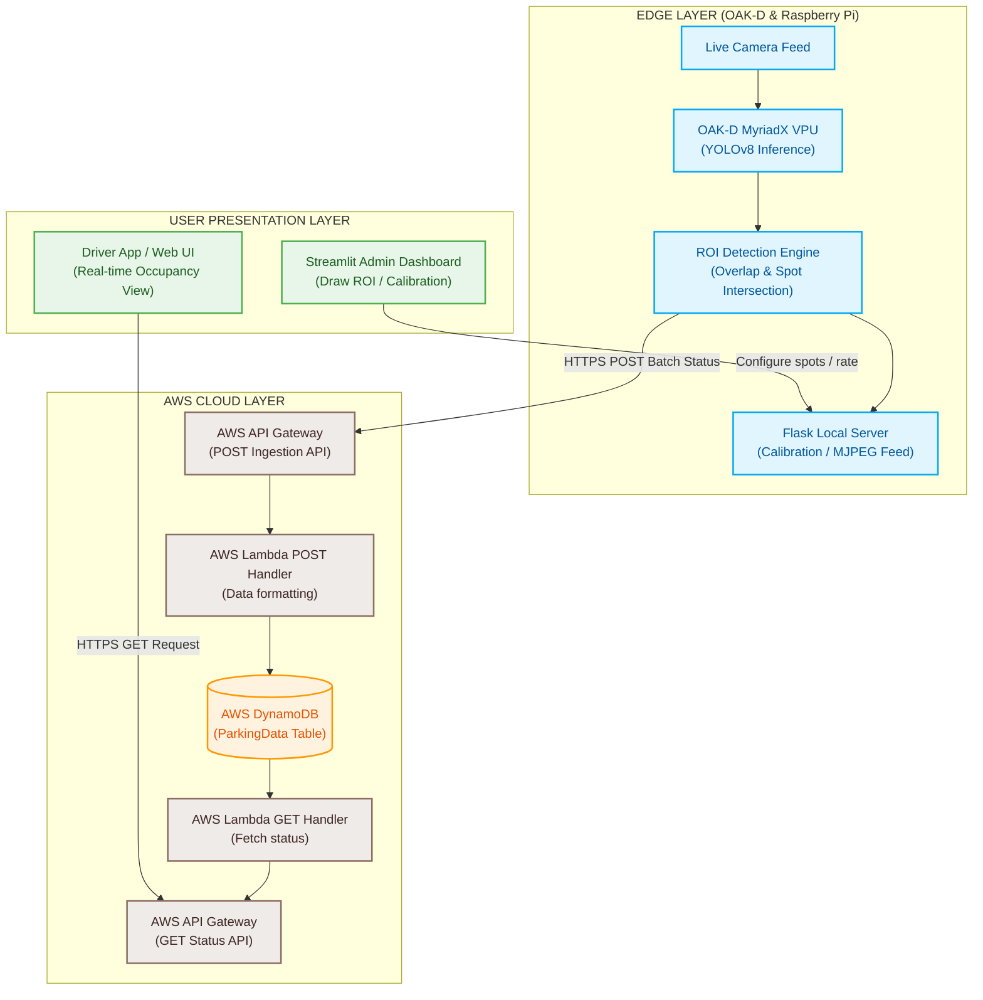

# Smart Parking Lot Management System

[](https://www.python.org/)
[](https://github.com/ultralytics/ultralytics)
[](https://aws.amazon.com/)
[](https://docs.luxonis.com/)
[](https://streamlit.io/)
[](https://flask.palletsprojects.com/)

A real-time, edge-to-cloud smart parking lot management system. This project deploys a trained YOLOv8 model on edge hardware (OAK-D / Raspberry Pi) to detect free and occupied parking spots. Results are updated to a cloud database (AWS DynamoDB) via an API gateway, enabling real-time vacancy tracking and dashboard visualization for parking administrators and drivers.

---

## The "Why" (Real-World Value)

In urban areas, drivers waste an average of 15 minutes searching for parking spots, causing traffic congestion, increased carbon emissions, and driver frustration. Parking operators also lack real-time visibility into space utilization. 

This system solves these issues by:
* **Reducing Search Time:** Provides real-time spot vacancy status directly to drivers.
* **Optimizing Facility Management:** Offers parking operators granular utilization metrics, helping them optimize pricing (e.g., dynamic hourly rates based on distance from the entrance) and parking layout design.
* **Low-Cost Deployment:** Utilizes low-power edge processors and VPUs (Visual Processing Units) to perform local inference, saving cloud bandwidth and storage costs.

---

## Tech Stack

### Core Machine Learning & Vision
* **YOLOv8 (Ultralytics):** Custom object detection model trained to identify empty vs. occupied spots.
* **Roboflow / PKLot:** Used for dataset annotation, augmentation, and versioning.
* **ONNX & DepthAI SDK:** Model compiled to MyriadX `.blob` format for hardware acceleration on OAK-D VPUs.

### Edge Device & APIs
* **Raspberry Pi 4 / OAK-D Lite:** Edge hardware hosting the camera stream and inference loop.
* **Flask:** Lightweight API server serving live video feeds and local settings.
* **Streamlit & Streamlit Drawable Canvas:** Calibration dashboard for defining spot boundaries (regions of interest) on the live video feed.

### Cloud Infrastructure
* **AWS API Gateway:** REST endpoint handling secure data ingestion.
* **AWS Lambda:** Serverless microservices to process parking logs (POST) and fetch current occupancy (GET).
* **AWS DynamoDB:** NoSQL database storing transactional spot availability data.

---

## Architecture & Data Flow



---

## Quickstart Guide

This guide walks you through running the edge system and calibration tool locally using simulated camera inputs or an OAK-D device.

### 1. Prerequisites
* Python 3.9 or 3.10
* Windows, Linux, or macOS
* (Optional) OAK-D Camera connected via USB. (If not connected, modify the source input to load a static video or web stream).

### 2. Installation
Clone the repository and install the dependencies:
```bash
# Clone the repository
git clone https://github.com/naimul214/Smart-Parking-Lot-AI-system.git
cd Smart-Parking-Lot-AI-system

# Create and activate a virtual environment
python -m venv .venv
# On Windows:
.venv\Scripts\activate
# On Linux/macOS:
source .venv/bin/activate

# Install dependencies
pip install -r requirements.txt
```

### 3. AWS DynamoDB Credentials
To enable cloud sync, configure your AWS credentials in your environment or a local `.env` file at the root:
```env
AWS_ACCESS_KEY_ID=your_access_key
AWS_SECRET_ACCESS_KEY=your_secret_key
AWS_DEFAULT_REGION=us-east-1
DYNAMO_TABLE_NAME=ParkingData
```

### 4. Running the Applications

#### Option A: Run the Live Inference Flask Server
This runs the local edge server, serving the processed live video feed:
```bash
cd Edge-Device-Code
python main.py
```
Access the video feed and API configuration at `http://localhost:5000`.

#### Option B: Run the Streamlit Calibration Dashboard
To calibrate new parking lot boundaries, draw regions of interest (spots) dynamically:
```bash
cd Edge-Device-Code
streamlit run parking_app.py
```
Open `http://localhost:8501` in your browser. Click **Capture Current View**, draw bounding boxes over your parking spots, and click **Save Configuration**.

---

## Results & Performance Metrics

> [!NOTE]
> **Hiring Manager Review Note:** Below are the performance summaries on standard benchmarks.

### Model Accuracy
* **mAP50:** `0.92` (Class: occupied vs. empty)
* **Precision:** `0.89`
* **Recall:** `0.91`

### Edge Hardware Benchmarks
* **OAK-D VPU Frame Rate:** `12 - 15 FPS` at `640x640` resolution.
* **DynamoDB Latency:** ~`180ms` roundtrip per batch write (every 3 seconds).

*(Insert screenshot or performance dashboard/GIF here demonstrating the active camera feed with green/red spot overlays)*

---

## Limitations & Future Work

* **Environmental Robustness:** YOLOv8 detections are susceptible to degradation under heavy glare, deep night shadows, and snow cover.
* **Camera Perspective Distortion:** Overlapping vehicle boundaries (occlusion) in angled camera views can misidentify adjacent spaces. Future work will explore multi-camera perspective homography mapping.
* **Static Bounding Boxes:** The system relies on static spot definitions calibrated via the Streamlit UI. Integrating dynamic slot lines based on auto-segmented parking lines would remove manual calibration.
* **Edge Batching Optimization:** Moving from independent REST updates to MQTT protocols (e.g., AWS IoT Core) would reduce communication overhead and bandwidth consumption.

---

## Connect

* **Author:** Naimul Hridoy
* **Education:** Honours Bachelor of AI, Durham College (Class of April 2026)
* **Email:** naimul.hridoy214@gmail.com
* **LinkedIn:** [naimul214](https://www.linkedin.com/in/naimul214)
* **GitHub:** [naimul214](https://github.com/naimul214)
* **Project Team Members:** Armaan, Naimul, and Honor
